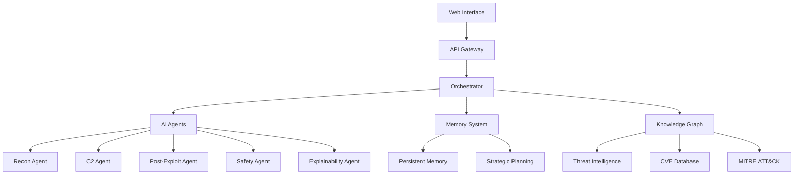

# Cyber-LLM: Complete User Guide

## 🚀 Welcome to Cyber-LLM

Cyber-LLM is a next-generation AI-powered cybersecurity platform that combines advanced multi-agent intelligence, comprehensive threat analysis, and enterprise-grade compliance into a single, powerful solution. This guide will help you get started and make the most of the platform's capabilities.

## 📋 Table of Contents

1. [Quick Start](#quick-start)
2. [Architecture Overview](#architecture-overview)
3. [Core Features](#core-features)
4. [Installation & Deployment](#installation--deployment)
5. [Configuration](#configuration)
6. [Using the AI Agents](#using-the-ai-agents)
7. [Enterprise Features](#enterprise-features)
8. [API Documentation](#api-documentation)
9. [Best Practices](#best-practices)
10. [Troubleshooting](#troubleshooting)

## 🏁 Quick Start

### Prerequisites

- **Operating System**: Linux (Ubuntu 20.04+ recommended), macOS, or Windows with WSL2
- **Container Runtime**: Docker 20.10+ and Docker Compose
- **Orchestration**: Kubernetes 1.21+ (for production deployment)
- **Resources**: Minimum 8GB RAM, 4 CPU cores, 50GB storage
- **Python**: 3.9+ (for development)

### 5-Minute Setup

1. **Clone the Repository**
   ```bash
   git clone https://github.com/734ai/cyber-llm.git
   cd cyber-llm
   ```

2. **Start with Docker Compose**
   ```bash
   docker-compose up -d
   ```

3. **Access the Web Interface**
   ```
   http://localhost:8080
   ```

4. **Run Your First Security Assessment**
   ```bash
   # CLI interface
   ./scripts/cyber-cli.py scan --target example.com --type reconnaissance
   ```

### Quick Demo

```python
from src.agents.orchestrator import CyberLLMOrchestrator

# Initialize the orchestrator
orchestrator = CyberLLMOrchestrator()

# Run a comprehensive security assessment
results = await orchestrator.run_assessment({
    "target": "example.com",
    "scope": ["reconnaissance", "vulnerability_scan"],
    "compliance_framework": "NIST"
})

print(f"Assessment completed: {results['summary']}")
```

## 🏗️ Architecture Overview

### Core Components



### Agent Ecosystem

- **🔍 Reconnaissance Agent**: Network discovery and enumeration
- **🎯 C2 Agent**: Command and control simulation
- **💥 Post-Exploit Agent**: Post-exploitation techniques
- **🛡️ Safety Agent**: Ethical constraints and safety monitoring
- **📊 Explainability Agent**: AI decision explanation and transparency

### Advanced Features

- **🧠 Persistent Memory**: Long-term learning and strategic reasoning
- **📈 Strategic Planning**: Multi-objective optimization and scenario planning
- **🤝 Multi-Agent Collaboration**: Swarm intelligence and distributed consensus
- **🔗 Tool Integration**: Universal plugin framework for security tools
- **📚 Knowledge Graph**: Real-time threat intelligence integration

## 🌟 Core Features

### AI-Powered Security Operations

#### Autonomous Penetration Testing
```bash
# Command line interface
cyber-llm pentest --target internal-network.corp \
    --scope "web-apps,network-services" \
    --compliance NIST \
    --report-format pdf
```

#### Continuous Threat Hunting
```python
# Python API
from cyber_llm import ThreatHunter

hunter = ThreatHunter()
threats = await hunter.continuous_hunt({
    "environment": "production",
    "detection_rules": "custom_rules.yaml",
    "ml_models": ["anomaly_detection", "behavior_analysis"]
})
```

#### Real-Time Incident Response
```yaml
# Configuration example
incident_response:
  automation_level: high
  response_time: <5min
  escalation_rules:
    - critical: immediate
    - high: <15min
    - medium: <1hour
```

### Enterprise Compliance

#### Automated Compliance Assessment
```python
# Compliance checking
from cyber_llm import ComplianceManager

compliance = ComplianceManager()
results = await compliance.assess_compliance([
    "SOC2_TYPE_II",
    "ISO27001", 
    "NIST_CYBERSECURITY"
])

print(f"Compliance Score: {results['overall_score']}/100")
```

#### Continuous Monitoring
- **Real-time compliance monitoring**
- **Automated reporting and documentation**
- **Violation detection and remediation**
- **Audit trail maintenance**

### Advanced Analytics

#### Performance Metrics
```python
# Performance monitoring
from cyber_llm import PerformanceMonitor

monitor = PerformanceMonitor()
metrics = await monitor.get_metrics([
    "detection_accuracy",
    "response_time", 
    "false_positive_rate",
    "coverage_percentage"
])
```

## 💻 Installation & Deployment

### Development Environment

#### Local Development Setup
```bash
# 1. Clone and setup environment
git clone https://github.com/734ai/cyber-llm.git
cd cyber-llm

# 2. Create virtual environment
python3 -m venv venv
source venv/bin/activate

# 3. Install dependencies
pip install -r requirements.txt

# 4. Setup configuration
cp config/development.yaml.example config/development.yaml
# Edit configuration as needed

# 5. Initialize database and services
./scripts/setup.sh

# 6. Run development server
python -m src.deployment.cli.cyber_cli
```

#### Docker Development Environment
```bash
# Build development image
docker build -t cyber-llm:dev -f Dockerfile.dev .

# Run with development configuration
docker run -p 8080:8080 -v $(pwd):/app cyber-llm:dev
```

### Production Deployment

#### Kubernetes Deployment
```bash
# 1. Configure environment
export KUBECONFIG=/path/to/kubeconfig
export DOCKER_REGISTRY=your-registry.com

# 2. Deploy with Helm
helm install cyber-llm ./charts/cyber-llm \
    --namespace cyber-llm-prod \
    --create-namespace \
    --values production-values.yaml

# 3. Verify deployment
kubectl get pods -n cyber-llm-prod
```

#### Cloud Provider Specific

##### AWS EKS
```bash
# Deploy to AWS EKS
./scripts/deploy-aws-eks.sh \
    --cluster-name cyber-llm-prod \
    --region us-west-2 \
    --node-count 5
```

##### Azure AKS
```bash
# Deploy to Azure AKS
./scripts/deploy-azure-aks.sh \
    --resource-group cyber-llm-rg \
    --cluster-name cyber-llm-prod \
    --location westus2
```

##### Google GKE
```bash
# Deploy to Google GKE
./scripts/deploy-gcp-gke.sh \
    --project cyber-llm-project \
    --cluster-name cyber-llm-prod \
    --zone us-west1-a
```

### High Availability Configuration

```yaml
# production-values.yaml
replicaCount: 3

autoscaling:
  enabled: true
  minReplicas: 3
  maxReplicas: 20
  targetCPUUtilizationPercentage: 70

persistence:
  enabled: true
  storageClass: fast-ssd
  size: 100Gi

monitoring:
  enabled: true
  prometheus: true
  grafana: true
  alertmanager: true

security:
  networkPolicies: true
  podSecurityPolicies: true
  rbac: true
```

## ⚙️ Configuration

### Environment Configuration

#### Basic Configuration
```yaml
# config/production.yaml
application:
  name: "Cyber-LLM"
  environment: "production"
  log_level: "INFO"

ai_models:
  primary_model: "gpt-4-cybersecurity"
  embedding_model: "text-embedding-ada-002"
  fine_tuned_models:
    - "cyber-llm-recon-v1"
    - "cyber-llm-exploit-v1"

security:
  authentication:
    method: "oauth2"
    providers: ["azure", "okta"]
  
  encryption:
    algorithm: "AES-256-GCM"
    key_rotation: "24h"
  
  compliance:
    frameworks: ["SOC2", "ISO27001", "NIST"]
    audit_logging: true

database:
  primary:
    type: "postgresql"
    host: "postgres.cyber-llm.svc.cluster.local"
    port: 5432
    ssl: true
  
  graph:
    type: "neo4j"
    uri: "bolt://neo4j.cyber-llm.svc.cluster.local:7687"
  
  cache:
    type: "redis"
    cluster_mode: true
```

#### Advanced AI Configuration
```yaml
ai_agents:
  recon_agent:
    model: "cyber-llm-recon-v1"
    max_concurrent_tasks: 5
    timeout: 300
    capabilities:
      - "network_discovery"
      - "service_enumeration"
      - "vulnerability_scanning"
  
  safety_agent:
    model: "cyber-llm-safety-v1"
    intervention_threshold: 0.8
    monitoring:
      - "ethical_violations"
      - "destructive_actions"
      - "unauthorized_access"

memory_system:
  persistent_memory:
    storage_backend: "postgresql"
    retention_policy: "1year"
    consolidation_frequency: "daily"
  
  strategic_planning:
    planning_horizon: "30days"
    scenario_count: 10
    optimization_method: "multi_objective"
```

### Integration Configuration

#### Tool Integration
```yaml
external_tools:
  nmap:
    type: "cli_wrapper"
    executable: "/usr/bin/nmap"
    timeout: 600
    
  metasploit:
    type: "rest_api"
    endpoint: "https://msf.internal.corp/api"
    authentication: "api_key"
    
  splunk:
    type: "python_library" 
    module: "splunk_sdk"
    config:
      host: "splunk.corp.com"
      port: 8089

threat_intelligence:
  sources:
    mitre_attack:
      enabled: true
      update_frequency: "daily"
    
    cve_feeds:
      enabled: true
      sources: ["mitre", "nvd"]
    
    commercial_feeds:
      - name: "threat_connect"
        api_key: "${THREAT_CONNECT_API_KEY}"
```

## 🤖 Using the AI Agents

### Reconnaissance Agent

#### Basic Network Discovery
```python
from cyber_llm import ReconAgent

# Initialize agent
recon = ReconAgent()

# Perform network discovery
results = await recon.discover_network({
    "target_range": "192.168.1.0/24",
    "techniques": ["ping_sweep", "port_scan", "service_enumeration"],
    "stealth_level": "moderate"
})

# Analyze results
for host in results['discovered_hosts']:
    print(f"Host: {host['ip']} - Services: {host['open_ports']}")
```

#### Advanced Reconnaissance
```python
# Comprehensive target profiling
profile = await recon.profile_target({
    "target": "example.com",
    "depth": "deep",
    "include": [
        "dns_enumeration",
        "subdomain_discovery", 
        "technology_stack",
        "employee_enumeration",
        "social_media_intel"
    ],
    "osint_sources": ["shodan", "virustotal", "censys"]
})
```

### C2 Agent

#### Command and Control Simulation
```python
from cyber_llm import C2Agent

c2 = C2Agent()

# Establish simulated C2 channel
channel = await c2.establish_channel({
    "protocol": "https",
    "encryption": "AES-256",
    "steganography": True,
    "beacon_interval": 300
})

# Execute commands through C2
results = await c2.execute_commands([
    {"cmd": "system_info", "args": {}},
    {"cmd": "privilege_check", "args": {}},
    {"cmd": "network_discovery", "args": {"range": "local"}}
])
```

### Post-Exploit Agent

#### Lateral Movement Simulation
```python
from cyber_llm import PostExploitAgent

post_exploit = PostExploitAgent()

# Simulate lateral movement
movement_results = await post_exploit.lateral_movement({
    "current_host": "192.168.1.100",
    "target_network": "192.168.1.0/24",
    "techniques": ["smb_relay", "kerberoasting", "golden_ticket"],
    "stealth_mode": True
})

# Data exfiltration simulation  
exfil_results = await post_exploit.simulate_exfiltration({
    "target_data": ["customer_db", "financial_records"],
    "methods": ["dns_tunneling", "steganography"],
    "detection_evasion": True
})
```

### Safety Agent

#### Ethical Monitoring
```python
from cyber_llm import SafetyAgent

safety = SafetyAgent()

# Monitor for ethical violations
monitoring = await safety.start_monitoring({
    "scope": "all_agents",
    "rules": [
        "no_destructive_actions",
        "respect_authorization_boundaries",
        "data_privacy_protection"
    ],
    "intervention_level": "automatic"
})

# Safety assessment
assessment = await safety.assess_action({
    "action": "file_deletion",
    "target": "/tmp/test_file",
    "context": "penetration_test",
    "authorization_level": "limited"
})
```

## 🏢 Enterprise Features

### Compliance Management

#### SOC 2 Compliance
```python
from cyber_llm import ComplianceManager

compliance = ComplianceManager()

# Perform SOC 2 Type II assessment
soc2_results = await compliance.assess_soc2_compliance({
    "scope": "entire_organization",
    "audit_period": "12_months", 
    "evidence_collection": True,
    "automated_testing": True
})

# Generate compliance report
report = await compliance.generate_report({
    "format": "pdf",
    "template": "soc2_executive_summary",
    "include_remediation": True
})
```

#### Continuous Compliance Monitoring
```python
# Setup continuous monitoring
monitor = await compliance.setup_continuous_monitoring({
    "frameworks": ["SOC2", "ISO27001", "NIST"],
    "monitoring_frequency": "real_time",
    "alert_thresholds": {
        "critical_violation": 0,
        "high_risk": 5,
        "medium_risk": 20
    },
    "auto_remediation": True
})
```

### Governance and Risk Management

#### Risk Assessment
```python
from cyber_llm import RiskManager

risk_mgr = RiskManager()

# Comprehensive risk assessment
risk_assessment = await risk_mgr.assess_organizational_risk({
    "scope": "enterprise_wide",
    "assessment_type": "quantitative",
    "threat_modeling": True,
    "vulnerability_analysis": True,
    "impact_analysis": True
})

# Risk treatment planning
treatment_plan = await risk_mgr.generate_treatment_plan({
    "risk_appetite": "low",
    "budget_constraint": 500000,
    "timeline": "6_months",
    "prioritization": "risk_score"
})
```

### Advanced Analytics and Reporting

#### Executive Dashboard
```python
from cyber_llm import AnalyticsEngine

analytics = AnalyticsEngine()

# Generate executive metrics
executive_metrics = await analytics.generate_executive_dashboard({
    "time_period": "last_quarter",
    "metrics": [
        "overall_security_posture",
        "compliance_status", 
        "incident_trends",
        "threat_landscape",
        "roi_analysis"
    ],
    "visualization": "interactive"
})
```

## 📖 API Documentation

### REST API Endpoints

#### Authentication
```http
POST /api/v1/auth/login
Content-Type: application/json

{
    "username": "security_analyst",
    "password": "secure_password",
    "mfa_token": "123456"
}
```

#### Agents Management
```http
# Start assessment
POST /api/v1/agents/assessment
Authorization: Bearer <token>
Content-Type: application/json

{
    "target": "example.com",
    "agents": ["recon", "vulnerability"],
    "configuration": {
        "stealth_mode": true,
        "compliance_check": "SOC2"
    }
}

# Get assessment status
GET /api/v1/agents/assessment/{assessment_id}/status

# Get assessment results
GET /api/v1/agents/assessment/{assessment_id}/results
```

#### Compliance API
```http
# Get compliance status
GET /api/v1/compliance/status?framework=SOC2

# Run compliance check
POST /api/v1/compliance/assess
{
    "framework": "ISO27001",
    "scope": "full_organization",
    "generate_report": true
}

# Get compliance report
GET /api/v1/compliance/reports/{report_id}
```

### WebSocket API

#### Real-time Updates
```javascript
// Connect to real-time updates
const ws = new WebSocket('wss://api.cyber-llm.com/v1/realtime');

// Listen for assessment updates
ws.onmessage = function(event) {
    const data = JSON.parse(event.data);
    
    if (data.type === 'assessment_progress') {
        updateProgressBar(data.progress);
    } else if (data.type === 'threat_detected') {
        displayThreatAlert(data.threat);
    }
};
```

### Python SDK

#### Installation and Basic Usage
```bash
pip install cyber-llm-sdk
```

```python
from cyber_llm_sdk import CyberLLMClient

# Initialize client
client = CyberLLMClient(
    api_key="your-api-key",
    base_url="https://api.cyber-llm.com"
)

# Start assessment
assessment = await client.start_assessment({
    "target": "example.com",
    "type": "comprehensive"
})

# Monitor progress
async for update in client.stream_assessment_progress(assessment.id):
    print(f"Progress: {update.progress}% - Status: {update.status}")

# Get final results
results = await client.get_assessment_results(assessment.id)
```

## 💡 Best Practices

### Security Assessment Best Practices

#### Planning Phase
1. **Define Clear Scope**: Always establish clear boundaries and objectives
2. **Get Proper Authorization**: Ensure written authorization before any testing
3. **Risk Assessment**: Evaluate potential risks before starting
4. **Baseline Establishment**: Document current security posture

```python
# Example: Proper scope definition
scope = {
    "targets": ["192.168.1.0/24", "example.com"],
    "authorized_by": "CISO John Doe",
    "authorization_document": "pentest-auth-2024-001.pdf",
    "testing_window": "2024-01-15 to 2024-01-17",
    "excluded_systems": ["production-db.example.com"],
    "contact_information": "security@example.com"
}
```

#### Execution Phase
1. **Start with Reconnaissance**: Gather information before active testing
2. **Gradual Escalation**: Begin with passive techniques, escalate carefully
3. **Continuous Monitoring**: Watch for signs of disruption or detection
4. **Document Everything**: Maintain detailed logs of all activities

#### Reporting Phase
1. **Executive Summary**: Provide high-level overview for management
2. **Technical Details**: Include detailed findings for technical teams
3. **Risk Prioritization**: Rank findings by business impact
4. **Remediation Guidance**: Provide clear, actionable recommendations

### Performance Optimization

#### Resource Management
```yaml
# Optimal resource allocation
resource_limits:
  agents:
    recon_agent:
      cpu: "1000m"
      memory: "2Gi"
    c2_agent:
      cpu: "500m" 
      memory: "1Gi"
  
  databases:
    postgresql:
      cpu: "2000m"
      memory: "4Gi"
    neo4j:
      cpu: "1000m"
      memory: "3Gi"
```

#### Scaling Configuration
```python
# Auto-scaling configuration
scaling_config = {
    "min_replicas": 2,
    "max_replicas": 20,
    "cpu_threshold": 70,
    "memory_threshold": 80,
    "scale_up_cooldown": 300,
    "scale_down_cooldown": 600
}
```

### Security Hardening

#### Network Security
```yaml
network_policies:
  - name: "agent-isolation"
    spec:
      podSelector:
        matchLabels:
          app: "cyber-llm-agent"
      policyTypes:
      - Ingress
      - Egress
      ingress:
      - from:
        - podSelector:
            matchLabels:
              app: "cyber-llm-orchestrator"
```

#### Data Protection
```python
# Data encryption configuration
encryption_config = {
    "data_at_rest": {
        "algorithm": "AES-256-GCM",
        "key_management": "AWS-KMS",
        "rotation_period": "90days"
    },
    "data_in_transit": {
        "tls_version": "1.3",
        "cipher_suites": ["TLS_AES_256_GCM_SHA384"],
        "certificate_management": "cert-manager"
    }
}
```

## 🔧 Troubleshooting

### Common Issues and Solutions

#### Agent Connectivity Issues
```bash
# Check agent status
kubectl get pods -n cyber-llm -l app=agents

# View agent logs
kubectl logs -f deployment/recon-agent -n cyber-llm

# Test connectivity
kubectl exec -it recon-agent-pod -- curl http://orchestrator:8080/health
```

#### Performance Issues
```bash
# Monitor resource usage
kubectl top pods -n cyber-llm

# Check for resource constraints
kubectl describe pod recon-agent-pod -n cyber-llm

# Scale up if needed
kubectl scale deployment recon-agent --replicas=5 -n cyber-llm
```

#### Database Connection Issues
```python
# Test database connectivity
from cyber_llm.utils import DatabaseHealthCheck

health_check = DatabaseHealthCheck()
results = await health_check.check_all_connections()

for db_name, status in results.items():
    print(f"{db_name}: {status}")
```

### Debugging Tools

#### Log Analysis
```bash
# Centralized logging with ELK stack
# View real-time logs
kubectl logs -f -l app=cyber-llm -n cyber-llm | grep ERROR

# Search logs in Kibana
curl -X GET "elasticsearch:9200/cyber-llm-logs/_search" \
  -H 'Content-Type: application/json' \
  -d '{"query": {"match": {"level": "ERROR"}}}'
```

#### Performance Monitoring
```python
# Custom performance monitoring
from cyber_llm.monitoring import PerformanceProfiler

profiler = PerformanceProfiler()
with profiler.profile("assessment_execution"):
    results = await orchestrator.run_assessment(config)

# View performance metrics
metrics = profiler.get_metrics()
print(f"Execution time: {metrics['total_time']:.2f}s")
print(f"Memory usage: {metrics['peak_memory']:.2f}MB")
```

### Support and Community

#### Getting Help
- **Documentation**: [docs.cyber-llm.com](https://docs.cyber-llm.com)
- **Community Forum**: [forum.cyber-llm.com](https://forum.cyber-llm.com)
- **GitHub Issues**: [github.com/734ai/cyber-llm/issues](https://github.com/734ai/cyber-llm/issues)
- **Discord Community**: [discord.gg/cyber-llm](https://discord.gg/cyber-llm)

#### Enterprise Support
- **Email**: enterprise-support@cyber-llm.com
- **Phone**: +1-555-CYBER-LLM
- **Support Portal**: [support.cyber-llm.com](https://support.cyber-llm.com)

---

**© 2024 Cyber-LLM Project. Licensed under MIT License.**

*For the latest updates and advanced features, visit [cyber-llm.com](https://cyber-llm.com)*
